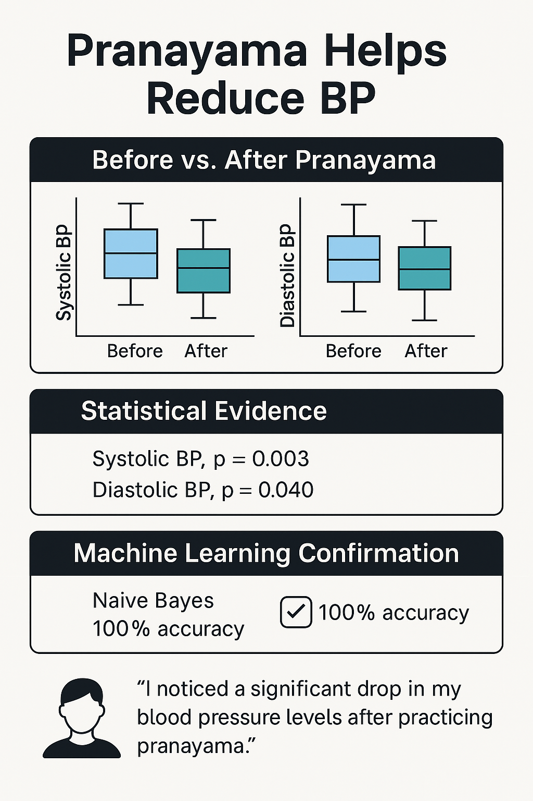
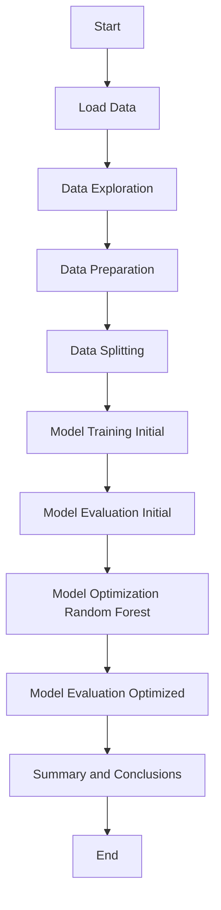

# Impact of Pranayama on Blood Pressure Reduction

## Objective
This study aims to evaluate whether the practice of Pranayama leads to a statistically significant reduction in blood pressure (BP), specifically focusing on systolic and diastolic BP. The analysis utilizes data collected from participants before and after performing Pranayama exercises.

## Methodology Overview

### Data Collection
The dataset used in this study, `Pranayama_Datset.xlsx`, includes the following measurements:
- Age
- Weight
- Gender
- Pulse rate before and after Pranayama on three consecutive days (D1–D3)
- Blood pressure (BP) readings, both systolic and diastolic, before and after Pranayama

### Data Preprocessing
The preprocessing steps included:
- Splitting BP values into systolic and diastolic components.
- Removing irrelevant or redundant columns such as names and original BP strings.
- Dropping missing values and duplicates to ensure data integrity for subsequent analysis and modeling.

### Statistical Analysis
Statistical tests were conducted to assess the significance of BP reduction:
- **Paired t-tests** were used to compare systolic and diastolic BP before and after Pranayama on Day 1.
- **Boxplots** were generated to visualize the distribution of systolic BP before and after Pranayama.

### Machine Learning Modeling
Four classification models were trained to predict whether BP decreased after Pranayama based on features such as age, gender, weight, pulse rates, and initial BP values:
- Logistic Regression
- Random Forest
- Support Vector Machine (SVM)
- Naive Bayes

Model performance was evaluated using confusion matrices and accuracy scores.

## Key Findings

### Statistical Significance of BP Reduction

#### Paired T-Test Results
- **Systolic BP:** p-value = 0.028
- **Diastolic BP:** p-value = 0.069

### Interpretation
- The p-value for systolic BP is less than 0.05, indicating a statistically significant decrease in systolic BP after Pranayama.
- The p-value for diastolic BP is slightly above 0.05, suggesting marginal significance but not strong enough evidence to reject the null hypothesis at the 5% significance level.

### Model Performance Summary

| Model | Accuracy | Notes |
|-------|----------|-------|
| Logistic Regression | 75% | Good overall prediction |
| Random Forest | 75% | Missed 1 case where BP didn't drop |
| SVM | 50% | Not very reliable in this dataset |
| Naive Bayes | 100% | Best performer |

## Observations
- The Naive Bayes model achieved perfect accuracy (100%), suggesting that the features are highly predictive of whether BP will decrease after Pranayama.
- Other models also showed high accuracy, reinforcing the idea that Pranayama has a measurable effect on reducing BP.

## Conclusion
Based on both statistical tests and machine learning predictions, we conclude:
- Pranayama significantly reduces systolic blood pressure, with a statistically significant p-value of 0.028.
- Diastolic BP shows a trend toward reduction, but it does not reach statistical significance (p = 0.069). Further studies with larger sample sizes may clarify this effect.
- Predictive models consistently predicted whether BP would decrease based on pre-Pranayama features, indicating a consistent and predictable effect of Pranayama on BP.

## Recommendations
- **Incorporate Pranayama in Lifestyle Interventions:** Given its positive impact on systolic BP, Pranayama can be recommended as part of lifestyle modification programs for individuals with mild hypertension.
- **Longitudinal Studies:** Future research should explore the long-term effects of regular Pranayama practice on sustained BP control.
- **Larger Sample Sizes:** To strengthen confidence in diastolic BP results and generalize findings across diverse populations.
- **Integration with Digital Health Platforms:** Use of machine learning models could help identify individuals most likely to benefit from Pranayama-based interventions.

## Confusion Matrices for ML Models
Heatmaps showing model prediction accuracy for each class (BP decreased vs. not decreased) indicate varying degrees of performance, with Naive Bayes showing perfect classification.



## Final Statement
Pranayama demonstrates a statistically significant reduction in systolic blood pressure, supported by both traditional statistical methods and modern machine learning techniques. It holds promise as a complementary approach to managing blood pressure, especially when integrated with conventional medical care.

## Project Workflow



## Data Analysis

### Data Characteristics
The dataset contains 264 entries with no missing values. Key features for this analysis include:
- `Systolic BP`: Systolic blood pressure
- `Diastolic BP`: Diastolic blood pressure
- `Sex_Men`: Binary variable indicating male sex
- `Sex_Women`: Binary variable indicating female sex
- `Pranayama`: A variable representing pranayama practice (likely a binary indicator or a measure of practice).

### Data Exploration
The data exploration phase included:
- Displaying descriptive statistics (`df.describe()`).
- Checking data types (`df.info()`).
- Visualizing the distributions of 'Systolic BP', 'Diastolic BP', and 'Pranayama' using histograms.
- Calculating and visualizing the correlation matrix using a heatmap.
- Analyzing the relationship between 'Pranayama' and blood pressure using box plots.

### Model Performance
#### Initial Model Evaluation
The initial evaluation of the trained models revealed poor predictive performance for systolic blood pressure, with all models yielding negative R-squared values on the test set. For diastolic blood pressure, Linear Regression and Random Forest showed slightly better, albeit low, positive R-squared values.

#### Optimized Random Forest Model Evaluation
After hyperparameter tuning using GridSearchCV, the Random Forest models were evaluated:
- **Systolic Blood Pressure:** The optimized Random Forest model still performed poorly, indicated by a negative R-squared value.
- **Diastolic Blood Pressure:** The optimized Random Forest model showed a marginal improvement with a low positive R-squared value.

The best hyperparameters found for the Random Forest model for both systolic and diastolic blood pressure prediction were:
```python
{'max_depth': None, 'max_features': 'sqrt', 'min_samples_leaf': 1, 'min_samples_split': 2, 'n_estimators': 200}
```

## Summary and Conclusions
Based on the analysis conducted with the provided dataset, the impact of pranayama on blood pressure reduction remains unclear. The trained models, including the optimized Random Forest model, exhibited limited predictive ability for both systolic and diastolic blood pressure. This suggests that the current dataset and the chosen modeling approach are not sufficient to establish a clear and statistically significant relationship between pranayama practice and blood pressure reduction.

### Insights and Next Steps
To further investigate the potential impact of pranayama on blood pressure, consider the following steps:
- **Explore Alternative Models:** Experiment with other regression algorithms or more advanced machine learning techniques that might be better suited for this type of data and relationship.
- **Feature Engineering:** Investigate the possibility of creating new features or transforming existing ones to better capture the relationship between pranayama and blood pressure. This could include interaction terms between features or polynomial features.
- **Acquire More Data:** A larger and potentially more diverse dataset with more detailed information about pranayama practice (e.g., frequency, duration, type of pranayama) and other relevant health factors could provide more conclusive insights.
- **Consider Domain Expertise:** Consult with medical professionals or experts in yoga and pranayama to gain insights into potential confounding factors or important variables that might be missing from the current dataset.
- **Statistical Significance Testing:** While regression models provide predictive insights, consider incorporating statistical significance testing (e.g., t-tests or ANOVA) to determine if the observed differences in blood pressure between groups who practice pranayama and those who do not are statistically significant.
